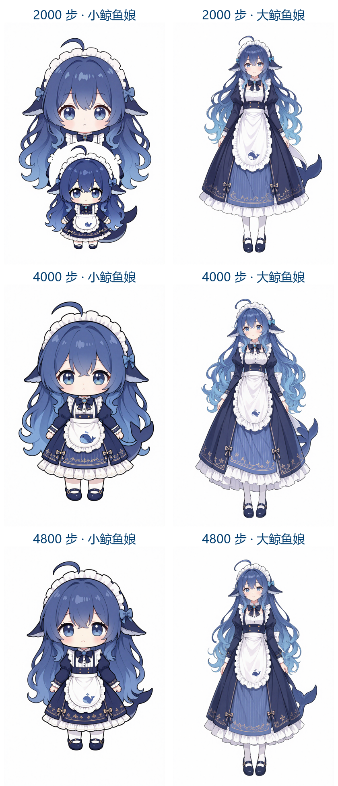
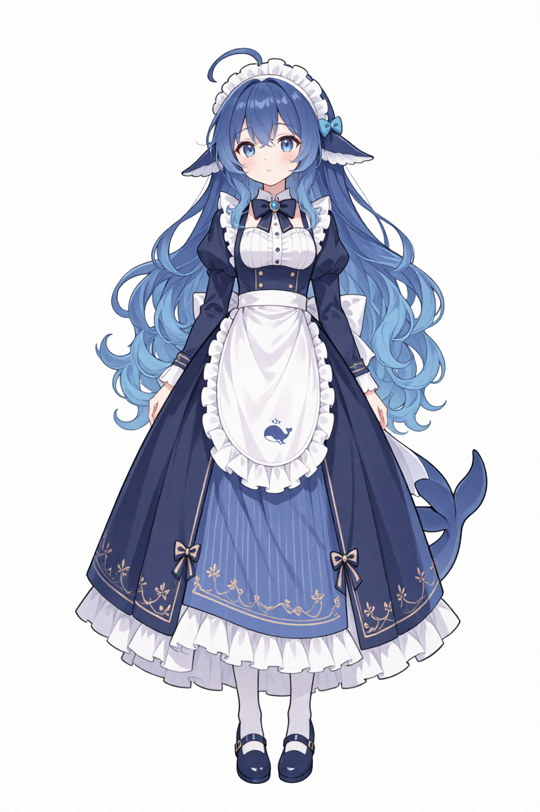
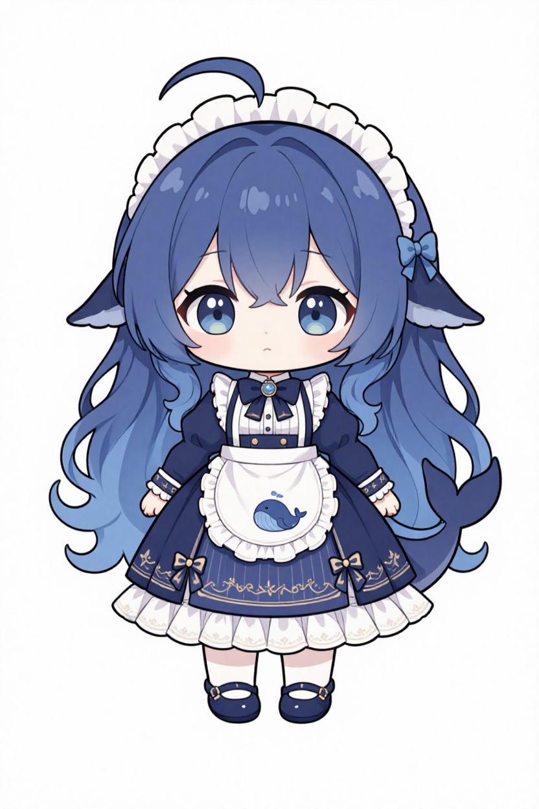
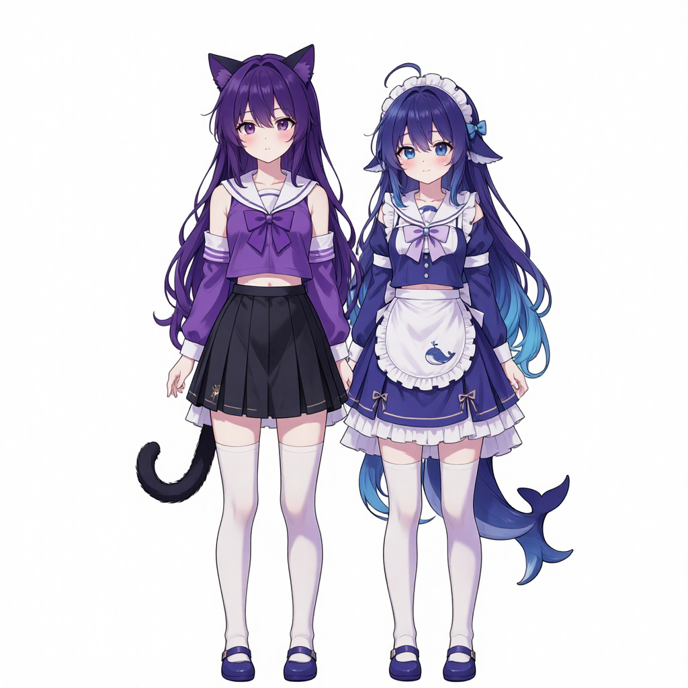

# Whale Maid LoRA (Z-Image Turbo)

Dual-form whale girl LoRA for **Z-Image-Turbo** — one LoRA, two characters, controlled by trigger words.

鲸鱼娘双形态 LoRA（Z-Image-Turbo 底模）：一个 LoRA 包含大小两种形态，用触发词切换。

## Downloads 下载（3 versions / 三个版本）

| File 文件 | Steps 步数 | Notes 说明 |
|---|---|---|
| [`ZImage-lora-whale-maid-4000steps.safetensors`](https://github.com/Sumireaks/whale-maid-lora/releases/download/v1.0/ZImage-lora-whale-maid-4000steps.safetensors) | 4000 | **Recommended 推荐** — cleanest details, most stable 细节最干净、最稳定 |
| [`ZImage-lora-whale-maid-2000steps.safetensors`](https://github.com/Sumireaks/whale-maid-lora/releases/download/v1.0/ZImage-lora-whale-maid-2000steps.safetensors) | 2000 | Softer / may duplicate subjects 偏柔和，偶发主体重复 |
| [`ZImage-lora-whale-maid-4800steps.safetensors`](https://github.com/Sumireaks/whale-maid-lora/releases/download/v1.0/ZImage-lora-whale-maid-4800steps.safetensors) | 4800 | Slightly stronger stylization 风格化略强 |

All versions were trained with the same dataset — pick by taste. Each file contains BOTH forms.
三个版本训练数据完全相同，按口味挑选即可；每个文件都同时包含大小两种形态。


*(Left column: chibi form · Right column: normal proportion · Rows: 2000 / 4000 / 4800 steps)*
（左列 Q 版 · 右列正常比例 · 三行依次为 2000 / 4000 / 4800 步）

| Trigger 触发词 | Form 形态 |
|---|---|
| `小鲸鱼娘` | Chibi / Q-version whale maid 小鲸鱼娘（Q版） |
| `大鲸鱼娘` | Normal human proportion whale maid 大鲸鱼娘（正常人体比例） |




More samples per version / 各版本更多示例：
`example_2000steps_small.png` · `example_2000steps_large.png` ·
`example_4800steps_small.png` · `example_4800steps_large.png`

## Recommended Settings 推荐参数

| Item | Value |
|---|---|
| Base model 底模 | Z-Image-Turbo (fp8 / bf16) |
| Sampler 采样器 | euler（或 res_multistep） |
| Scheduler 调度器 | simple |
| Steps 步数 | 8–12 |
| CFG | 1.0 |
| LoRA strength 强度 | 0.8 – 1.0 |
| Resolution 分辨率 | 832×1248 / 1024×1024 |

## Prompt Examples 提示词示例

```
小鲸鱼娘，Q版，正面全身站姿，直视镜头，表情平静，纯白背景，动漫风格
```
```
大鲸鱼娘，正常人体比例，正面全身站姿，直视镜头，表情平静，纯白背景，动漫风格
```

Character features (learned by the LoRA): blue gradient long hair, whale fin ears,
maid headdress, dark-blue maid dress with a white whale-embroidered apron, whale tail.

角色特征（LoRA 已学会）：蓝渐变长发、鲸鱼鳍耳、女仆发箍、深蓝女仆裙配白色鲸鱼刺绣围裙、鲸鱼尾巴。

## Two characters in one image 双角色同框

Using both trigger words in one prompt works, but expect some feature bleeding between
characters. For clean two-character shots, generate separately and composite, or use
[FreeFuse](https://github.com/yaoliliu/FreeFuse) (supports Z-Image-Turbo) to auto-isolate
each LoRA's influence.

两个触发词写在同一句提示词里可以出双角色同框，但会有轻微特征互染（如配饰串色）。
要干净的同框图，建议分开生成后合成，或使用支持 Z-Image-Turbo 的 FreeFuse 自动隔离。



## Training 训练信息

- Base: Z-Image-Turbo (ComfyUI repack)
- 40 captioned images (15 chibi + 25 normal proportion), natural-language Chinese captions
- Trigger-word aware captions: `小鲸鱼娘，Q版，…` / `大鲸鱼娘，正常人体比例，…`
- Trained with LiblibAI cloud; selected checkpoint at 4000 steps
- Colors are NOT locked by the LoRA — specify clothing colors in the prompt if needed

## License 使用说明

Free to use for personal and commercial works. Please don't claim the LoRA itself as your own training result.

可自由用于个人与商业作品，请勿将本 LoRA 冒充为自己训练的成果。
